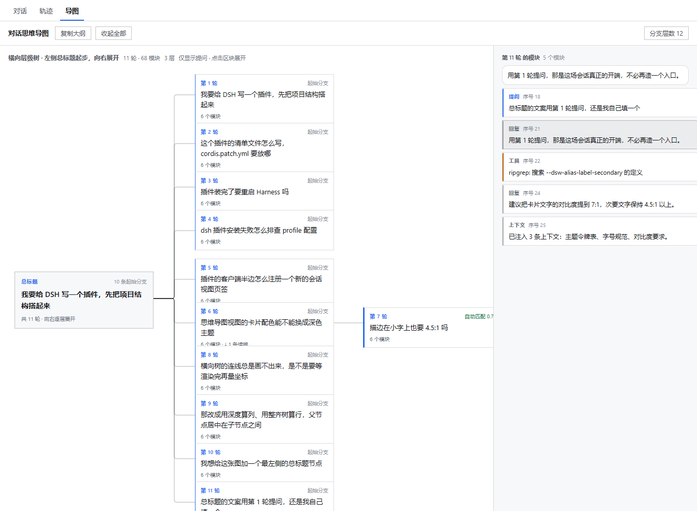

# @nydsg/dsh-mindmap

[](https://github.com/nydsg/dsh-mindmap/actions/workflows/test.yml)
[](https://www.npmjs.com/package/@nydsg/dsh-mindmap)
[](LICENSE)
[](https://github.com/awesome-dsh-plugin/awesome-dsh-plugin)

**[中文](README.md) · English**

Renders a DSH conversation as one **horizontal hierarchy**: a single **title node** on the far left (its text is the **first question** of the session), then every turn opens **rightwards**, one level at a time (column = depth, row = tidy-tree slot). Each card shows **only your question**. The plugin compares each turn's question against every earlier one and continues the closest branch; when nothing is close enough, the turn starts a new branch hanging off the title. The whole map is **flat**: 1px outlines, solid fills, square corners, no shadows, no gradients, and orthogonal connectors.

Select a card and the side panel lists that turn's modules (reply / tool calls / injected context); click a row for its details. The same panel lets you **re-attach a turn by hand**.

**Everything is computed locally: no network requests, no model calls, no build step.**



## Install

```bash
dsh plugin --profile web add @nydsg/dsh-mindmap
```

Restart Harness and a third tab — **Map** — appears next to Chat and Trajectory. No existing surface is changed.

> That command goes through npm. If the package is not published yet (`npm view @nydsg/dsh-mindmap` finds nothing), mount it from source using the [local development install](#local-development-install) below.

Also available through the **DSH plugin market**, which is fed by the curated
[awesome-dsh-plugin](https://github.com/awesome-dsh-plugin/awesome-dsh-plugin)
list (once listed).

## What it does

| Capability | Detail |
|---|---|
| Map tab | A third session view beside Chat / Trajectory. Registers into the `conversation.view` slot and touches nothing else |
| Title node | One node in the leftmost column whose text is the **first question**. It is not a turn: it owns no modules, cannot be selected, and produces no connector of its own |
| Horizontal hierarchy | Column = depth, row = arrangement. A parent connects to its children with an orthogonal elbow. Card positions are **computed**, never measured from the DOM |
| Single entry point | Every branch root hangs off the title, so the map has exactly **one** starting point. `N first branches` at the bottom of the title says how many |
| Automatic branching | Each question is matched against every earlier question; above the threshold it continues the best one, otherwise it starts a new branch (scoring below) |
| Context links | When the wording does not match, the plugin asks what that turn was already **discussing** — its reply and its tool calls. If this turn asks about something already on the table there, it links, labelled `context {score}`. Local lexical analysis, not a model call |
| Cards show only questions | Number + branch badge + question text (up to 4 lines) + module count. Replies are not on the card |
| Manual branch control | Pin a card under any earlier turn, force it to a new branch, or hand it back to the matcher; one click clears every manual link |
| Similarity candidates | The panel lists the 5 closest earlier questions with their scores — click one to attach under it |
| Persistence | Manual links are stored per session in `localStorage` and survive a reload; **a hand-made link is never overwritten by the matcher** |
| Module panel | Selecting a card lists that turn's module rows; clicking a row shows its reply text, keyword-weight bars, backward analysis, and suggested follow-ups |
| Depth control | The toolbar limits how many **branch** levels are drawn (the title is not one of them). A folded subtree offers "N more continuations" and expands in place |
| Keyword filter | Matching cards stay normal, non-matching cards **dim instead of disappearing** (removing them would make a parent vanish and the structure would lie) |
| Outline export | Copy the whole map as a Markdown outline |
| Flat surface | 1px outlines, solid fills, square corners, no shadows, no gradients; connectors are 1px orthogonal elbows |
| Offline | All analysis happens in the browser. No network, no model calls |

## How a branch is decided

Two signals, in a **strict division of labour — not a weighted blend**.

### Step 1: question wording (the primary signal, threshold `0.40`)

Every question has two kinds of words: **background words** shared by the whole session (product names, "how", file names) and **signal words** belonging to only a few questions (appearing ≤2 times in the session, or above that question's own median IDF). **Score = shared signal weight ÷ the smaller side's signal weight**. At or above `0.40`, the turn continues the best match; below it, the decision moves to step 2.

Why not cosine: measured on real cases (see [`tools/TEST-REPORT.md`](tools/TEST-REPORT.md)), true links score 0.29–0.72 in cosine while **background-only** false matches score 0.16–0.20 — **no cosine threshold separates them**. With the signal ratio, true links land at 0.44–1.00 and false matches at ≤0.28, a clean gap, and the threshold comes straight out of that table.

### Step 2: context resonance (the fallback signal, threshold `0.65`)

**Consulted only when step 1 is silent.** It asks what that turn was already **talking about** — its question, its reply, and its tool calls:

```
resonance = weight of this question's SIGNAL terms that appear in that turn's context
            ÷ total signal weight of this question
```

The shape of that ratio is the whole design, and all three parts matter:

- the numerator counts only terms that are **signal in the new question**, weighted by the session IDF. A word the whole session uses contributes almost nothing, so the session's background cannot connect everything;
- the denominator is that question's **own** signal weight, so the score answers "what share of what I am asking about was already discussed in that turn" — not "how long was that reply";
- a term that appears in the reply but **not in the question** is invisible here. That is what stops a long reply from linking to everything: a reply can only raise a score by covering terms the question actually asked with.

Measured with [`tools/context-experiment.mjs`](tools/context-experiment.mjs): a genuine context continuation scores **0.75–0.78**, while the case that must be refused — a reply that merely **names** a term the next question asks about while the thread is plainly something else — reaches **0.50**. The gate sweep scores identically from 0.50 to 0.75 and starts losing real links at 0.80, so `0.65` is the midpoint of that gap rather than a fitted value.

One constraint is not negotiable: **document frequency counts QUESTIONS, never replies.** Otherwise one chatty answer would redefine the session's background and reweight every other score. No end-to-end case pins that property, so a gate asserts it directly.

> Why not add the two scores: they answer **different questions** ("did this continue that question" vs "was this already discussed in that turn"). Adding them would let a long reply outvote an explicit question match — so step 2 only speaks when step 1 has nothing to say.

The automatic result is a **guess**, so any turn can be changed by hand, and a changed turn is never re-derived. A parent must be a **strictly earlier** turn; the code enforces that invariant, because otherwise the tree would contain a cycle and the renderer would recurse forever.

### Why the leftmost node is always a title

Similarity answers "which earlier turn does this one continue", and the answer is a **forest**: several mutually dissimilar questions each become the root of their own tree. Drawn directly, that is several trees side by side, and a reader cannot tell where the conversation began — which is exactly the "no starting point" problem.

So the layout adds one **synthetic node** above the forest. It occupies column 0, every tree of the forest hangs off it, and the drawing therefore has exactly **one** node without a parent, opening rightwards level by level. That node:

- carries the text of the **first question** — the session's real beginning, not a generic caption;
- has empty `modules` and is **not a button and not selectable**: it is not a turn, and the side panel, the outline and every per-turn control key off the turn, so it is excluded by construction;
- **does not consume a depth level**: the toolbar counts branch levels, and the title is not one, so at limit 1 the title and the first level are still drawn;
- draws no connector of its own (there is nothing to its left), but **does** draw one to each first branch — otherwise those branches would merely be "listed after" it instead of "hanging off" it.

### Why the layout is computed, not measured

The first version had invisible connectors, and the root cause was a **measured layout**: card coordinates came from `getBoundingClientRect` after paint, so they were always one frame stale, and any missed measurement pass left the connector layer empty.

Now every position comes from arithmetic:

- **column** = depth × (card width + column gap), with extra room after column 0 so the entry point reads as separate from the tree it owns
- **row** = tidy-tree allocation: a leaf consumes the next row slot, and a parent is **centered on its own subtree's span**

The second point is the important one. Allocating rows by a pre-order walk puts a parent *above* all of its children, so every connector has to run back upwards — which is exactly what makes a left-to-right tree unreadable. Centering the parent is what makes the fan-out read as a fan. `behaviour.mjs` asserts both: a parent's center must fall inside its children's vertical band, and cards must not overlap within a column (overlap **across** columns is normal, since a parent is centered between its children).

Only a **card's height** is measured (how many lines a question wraps to cannot be predicted), and it affects row spacing alone — not columns, not parent/child relations — so a measurement one frame late cannot make connectors disappear.

Connectors are **orthogonal elbows** rather than beziers: right out of the parent, turn half-way across the gap, then horizontally into the child's left edge. When both nodes sit on the same row it degenerates to a single straight line, which is the honest drawing of "these two line up". A curve would add decoration and hide which row a branch turns on.

A card never contains the reply: `registration.mjs` pins that with a structural assertion — `renderTreeCard` must render `turn.promptText`, must not contain `turn.answerText`, and must not call `renderCard` (module rows belong to the side panel; an expanding card would move its own height and shove every connector below it).

## Local development install

If you want to change the plugin rather than just use it, mount the repository directory into a profile:

1. Put this directory at `%APPDATA%\dsh-desktop\harness\profiles\web\node_modules\@nydsg\dsh-mindmap`;
2. Add a line to the user patch layer of `profiles/web/cordis.patch.yml`:

```yaml
- insert:
    - id: '@nydsg/dsh-mindmap'
      name: '@nydsg/dsh-mindmap'
```

3. Restart DSH (menu: Restart Harness) — the client module graph and the plugin bundle routes are generated once at startup, and **hot reloading cannot conjure a bundle route for a new plugin**.

Copy `lib/` back over the profile directory and restart; there is no build step.
Note that the desktop install is a **copy**, not a symlink: after editing `lib/`, run `dsh plugin add` once more to sync it, then restart Harness.

> Why the development version uses the patch layer rather than `dsh plugin add`: the desktop generation maintenance only takes over market-installed plugins and rewrites `package.json`; the patch layer is the one it leaves alone. A real install should use `dsh plugin --profile web add @nydsg/dsh-mindmap`, and must **not** keep the hand-written row as well — two loader entries with the same id make startup fail.

## Development

No build step: `lib/client.js` is a hand-authored `window.__ModuleLoader__.load({id, factory})` lazy-CJS bundle that calls `React.createElement` directly and needs no JSX compilation.

```
node tools/test.mjs          # runs the gates, then replays each historical bug to prove a gate turns red (CI and prepack both use this)
node tools/showcase.mjs      # what the engine actually decides on given conversations + the tree geometry
node tools/make-report.mjs   # regenerates tools/TEST-REPORT.md from the two above
node tools/check.mjs         # syntax + plugin face + bundle manifest + CSS token integrity / no hardcoded colours
node tools/behaviour.mjs     # segmentation, keywords, branch scoring, layout geometry, projection adapters
node tools/registration.mjs  # apply()/inject() contract + structural invariants
node tools/verify-pack.mjs   # pre-publish: manifest identity, required files, no developer-machine absolute paths
node tools/screenshot.mjs    # regenerates docs/screenshot.png (needs Edge or Chrome)
node tools/context-experiment.mjs  # score table and gate sweep for the context signal (a measuring bench, not a gate)
```

Everything is offline and deterministic, with no dependencies (only the screenshot
script needs a Chromium-based browser). `npm test` is `node tools/test.mjs`; the
`prepack` hook of `npm publish` runs it first.

> The image at the top of this README is **not a screen grab** but a rendered
> preview: it uses the plugin's **own stylesheet** (extracted from
> `lib/client.js`) and its **own layout arithmetic** (`layoutTree` / `placeTree` /
> `edgePath` run on the same sample conversation), so the card positions,
> connector paths and surface are what the plugin really draws. What is
> hand-written is the DOM skeleton around it (tab strip, toolbar, side panel) and
> the DSH theme token values. After a visual change, run `npm run screenshot`.

All three code gates (`check` / `behaviour` / `registration`) must report
`PASS (0 problems)`, and `test.mjs` must additionally report `all mutations caught`.
`verify-pack.mjs` is a fourth gate, but it only serves publishing and is run
before a release.

**A gate that cannot go red is not a gate.** `test.mjs` reintroduces each historical bug into a throwaway copy and asserts the named gate turns red — including the `useChat` contract, a manual branch being overwritten by the matcher, pre-order row allocation, missing connectors, the score falling back to a raw cosine, the title being folded away by the depth limit, the title's connectors being skipped, the title text being replaced by a generic caption, and an unquoted `@` in the manifest. A green suite on its own proves nothing. The current run is recorded in [`tools/TEST-REPORT.md`](tools/TEST-REPORT.md).

### Traps (do not repeat these)

**`@` in `cordis.patch.yml` must be quoted — unquoted, the plugin cannot be installed at all.**

```yaml
# Wrong: `@` is a YAML reserved indicator, so a plain scalar may not start with it.
#        js-yaml 4 rejects the entire file: bad indentation of a mapping entry (15:11)
- insert:
    - id: @nydsg/dsh-mindmap
      name: '@nydsg/dsh-mindmap'

# Right: quote both
- insert:
    - id: '@nydsg/dsh-mindmap'
      name: '@nydsg/dsh-mindmap'
```

The cost is that **the whole installation is rolled back** — `dsh plugin add` validates the manifest and restores `package.json`, `pnpm-lock.yaml` and `node_modules` when it fails — and at the time all three gates were green: `check.mjs` only parsed `lib/` and had never read the manifest. The manifest is the only input on the install path, so `check.mjs` now parses and validates it through `tools/yaml.mjs` (exactly one loader row, resolvable package name, no duplicate id), and two mutation cases (stripping the quotes, inserting the row twice) prove that gate bites.

**In the `inject()` face, sources must be declared under `hooks` under their raw names.**

```js
// Wrong: the renderer does not know this `useChat`, passes it through as an
//        ordinary prop, and the view gets a source object instead of a function
//        → useChat is not a function at runtime
return { useChat: chat, sessionId, writeDraft };

// Right: the renderer mints the useChat prop from `chat` via standardHookPropName
return { hooks: { chat }, sessionId, writeDraft };
```

The rule comes from `bindInjectSources` in `dsh-client-ui-renderer`: **with** a `hooks` key, each entry becomes a `use<Name>` prop through `standardHookPropName` (wrapped into a real Hook by `observableHook`); **without** it, the whole return value is passed through as props verbatim. `registration.mjs` now reproduces that semantics and asserts the shape, so a repeat turns red.

The more expensive lesson: the first `registration.mjs` used `inject()`'s return value as props directly, which **papered over the wrong contract on the plugin's behalf** and produced a false green. A gate has to reproduce the real framework's binding semantics, not bypass them.

**`instanceof` fails across realms.** In branch resolution, `overrides instanceof Map` was always false inside the test sandbox (the gate's Map and the bundle's vm are different realms), so **every manual link was silently dropped** — automatic results looked fine while manual control did nothing at all. It is now duck-typed (anything with `get`/`has`/`forEach` counts as a Map). Avoid `instanceof` for any value crossing a realm boundary (vm, iframe, worker).

**Do not rebuild React in test scaffolding.** To assert "a collapsed card shows no reply" I once wrote a walker over the element tree, and it kept failing on hook dispatchers, class component instantiation and `props.children` folding — emulation details **unrelated to the property under test** — each time showing up as a misleading red that cost far more than it returned. Structural assertions against the render function are exact, stable, and point at the real cause. When you genuinely need to assert on a rendered tree, use real React (e.g. `react-dom/server`) rather than hand-rolling it.

**Do not write assertions about results instead of properties.** My first assertion for the matcher was "a pair sharing only background words must not link" — but that pair does not link under a **raw cosine** either (short sentences have low cosine by nature), so the assertion stayed green while the property that needed protecting — **separation** — was not protected at all: reverting the scoring to cosine kept every gate green. Rewriting it to assert a wide gap between the two score classes (background pair `< 0.4`, true link `> 0.4`, difference `> 0.3`) made the mutation fail immediately. Pin the **discriminating property**, not a result that merely happened to hold at the time.

## Known limits

- **Chinese segmentation**: `Intl.Segmenter`'s `word` mode cuts most Chinese words down to single characters (`思维导图` → `思维|导|图`). The plugin does longest-run merging **inside the single-character runs the segmenter returns** (`导|图|插|件` → `导图插件`) but **does not cross** multi-character words the segmenter already produced (`思维`). So `思维导图` is reported as `思维` + `导图` rather than one word. That is deliberate: restoring it needs a dictionary, and forcing it with a sliding window invents words that do not exist (experiments produced `导图插件`). For the two uses here — keyword analysis and candidate questions — splitting into two words is usable.
- **The match score is not a cosine**; it is the shared-signal ratio over the smaller side (rules and measurements above).
- **Keyword threshold**: only words appearing ≥2 times in the session enter the keyword ranking; a word seen once appears only under "new topics".
- **Candidate questions are template-assembled**, not semantically generated. Genuinely understanding what the previous turn was about would need an LLM; this version deliberately calls no model, to stay instant and offline.
- **Paraphrases may still not connect** ("how to install a plugin" vs "how is a plugin installed"): both steps are **lexical**. The context signal rescues the case where a follow-up reuses words from the earlier **reply**, but a paraphrase that shares **no** vocabulary still becomes a new branch — in the example above, `装` and `安装` are different tokens. Manual attachment exists for exactly this. The `0.40` / `0.65` thresholds and the `12`-turn lookback are **derived from the case data** (the score table in `TEST-REPORT.md`, and the gate sweep in `tools/context-experiment.mjs`), but they still only cover the conversation shapes I constructed.
- **The context signal needs a reply to exist**: a turn that is still streaming has no reply text, so its context text falls back to its question (which the question signal already covers).
- **Chinese segmentation dilutes the context signal**: function words become signal terms too. Measured: `描边在小字上要满足 4.5:1 吗` segments to `描边|小字|上要|满足|4.5`, and because `上要` and `满足` are functional and absent from any reply, the denominator holds five terms while only three can match — resonance drops to `0.60`, just under the `0.65` gate. The signal is therefore sharpest on **short** questions and thinned by wordy ones. That is the inherent cost of a lexical method, not a mis-set threshold.
- **An exact tie is broken by recency, not by meaning**: the metric really does produce **identical** scores. Measured case: `#5` scores exactly `0.5642` against both `#1` and `#2`, because it shares the same set of words with each (`dsh/插件/安装/profile`) while their distinguishing words (`web`/`重启` vs `失败`/`排查`) do not match `#5`'s `要重` — the metric has **no information** with which to separate them, so the nearer turn wins. That is not a bug but the honest limit of a lexical metric, and it is why any turn can be re-linked by hand.
- **Very short follow-ups may not connect**: a question like "continue" has one or two generic words and little or no signal, so it becomes a new branch. Changing the parent by hand solves it.
- **Branches proceed linearly by turn**: a new turn can only attach under an **earlier** turn, so no back-reference (a later question becoming the parent of an earlier one) can appear.
- **There is exactly one title, and it always uses the first question**: no second entry node and no "change the title" UI. If the first turn has no prompt text, the title shows "(no prompt text in this turn)".
- **Only card height is measured**; columns and rows are all computed, so a measurement one frame late only shifts row spacing briefly and can never make connectors vanish. A font-loading height change after measurement may shift row spacing temporarily.
- **Unverified**: this machine cannot take screenshots. **The flat look, the corner geometry of the elbows, and the spacing between the title card and the first column still need your eyes.** What has been machine-checked is syntax, token integrity, colour compliance, the arithmetic properties of matching and layout (including the title column and its connectors), and structural invariants. Mutation verification only proves the gates catch **those classes** of regression, not that they catch every regression.

## License

[MIT](LICENSE)
